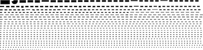

# {{{lab-mobviz}}}
## Table of Contents
<!-- START doctoc generated TOC please keep comment here to allow auto update -->
<!-- DON'T EDIT THIS SECTION, INSTEAD RE-RUN doctoc TO UPDATE -->
- [About](#about)

- [About](#about)
- [Inital setup](#inital-setup)
- [Adding a city](#adding-a-city)
  - [Process OSM data](#process-osm-data)
    - [1. Create geo files](#1-create-geo-files)
    - [2. Load into MongoDB](#2-load-into-mongodb)
    - [3. Street names](#3-street-names)
    - [4. Generate streets](#4-generate-streets)
  - [Generate Parking Spots](#generate-parking-spots)
    - [1. Create svgs](#1-create-svgs)
    - [2. Add neighborhood information to SVG/mongoDB](#2-add-neighborhood-information-to-svgmongodb)
  - [Calculate Area for Streets/Rails](#calculate-area-for-streetsrails)
    - [1. Calculate Area](#1-calculate-area)
    - [2. Add Area](#2-add-area)
  - [Find Landmark](#find-landmark)
    - [0. Finding a landmark](#0-finding-a-landmark)
    - [1. Tracing:](#1-tracing)
    - [2. Area:](#2-area)
    - [3. Convert to svg](#3-convert-to-svg)
    - [4. Edit in Sketch](#4-edit-in-sketch)
  - [Update Citymetadata.json](#update-citymetadatajson)
  - [Generate Street Coils](#generate-street-coils)
- [Team](#team)
- [Acknowledgement](#acknowledgement)
- [License](#license)

<!-- END doctoc generated TOC please keep comment here to allow auto update -->

## About
This repository shows how to preparate data and create the visuals which were used in the project {{{lab-mobviz}}} by [moovel lab](http://lab.moovel.com/).

## Inital setup
- Get [NodeJS][13]
- Get [osmconvert.c][8]. Set `border__edge_M 1300004` so it can handle larger poly files. Compile: `gcc osmconvert.c -lz -O3 -o osmconvert`
- Get [osmfilter][9]
- Get [MongoDB][11]
- Get [QGIS][2], install the osmpoly_export plugin
- Get [Anaconda][1] (Python 3.*)
- Get [SVGnest-batch][12]
- Extra python libraries to install: pymongo, shapely, haversine, [osmnx][10] (first rtree!), pyprind
- Get mongosm from [Stephan Bogner's fork][3], and in options.js of mongosm/lib, set `populateGeometry: false`. To get dependencies, run: `npm install` 

## Adding a city
Follow this order. If not noted otherwise, run commands in terminal. Examples for Berlin.

### Process OSM data
#### 1. Create geo files
1. Get shapefile of city boundary from somewhere. If nowhere found, use [Turbopass][4], mind [the correct admin_level][7]:  
`[out:json];  
(
  node[boundary="administrative"][admin_level=6](48.46, 8.79, 48.93, 9.50);
  way[boundary="administrative"][admin_level=6](48.46, 8.79, 48.93, 9.50);
) ;(._;>;);  
out skel;`
- Load file into QGIS, save as a duplicate with correct `CRS: EPSG:4326`, and save as `berlin_boundary.poly` via `Vector > Export OSM Poly`
- Download and unpack osm.bz2 file that contains the city from [geofabrik][6], e.g berlin-latest
- Crop osm file according the boundary using osmconvert `./osmconvert berlin-latest.osm -B=berlin_boundary.poly --drop-broken-refs -o=berlin_cropped.osm`

#### 2. Load into MongoDB
1. Load osm data into MongoDB via mongosm `node mongosm.js --max_old_space_size=8192 -db berlin_raw -f berlin_cropped.osm` (don't forget to run `npm install` before running the script the first time to install dependencies)
2. Set cityname parameter (in Jupyter notebook) and execute `01_generategeometries.ipynb`

#### 3. Street names
**Note:** osmfilter seems buggy and does not actually remove some things we want removed. That's why we need to manually remove them in the end.  

1. Use osmfilter to create a temporary osm file containing only the relevant streets (to derive names from) `./osmfilter berlin_cropped.osm --keep="highway=residential =primary =secondary =tertiary =unclassified" --drop="public_transport=stop_position public_transport=platform public_transport man_made boundary leisure amenity highway=traffic_signals =motorway_junction =bus_stop railway building entrance=yes barrier=gate barrier shop" > temp.osm`
- Extract names and export as csv `./osmconvert temp.osm --all-to-nodes --csv="name" > temp.csv`
- Sort alphabetically and discard duplicates `sort -u temp.csv > citydata/berlin_streetnames.txt`
- **Important:** Check manually and delete obvious errors. 
- Sort by length of string `cat citydata/berlin_streetnames.txt | awk '{ print length, $0 }' | sort -n -s | cut -d" " -f2- > citydata/berlin_streetnames_bylength.txt`
- **Important:** Check again manually for obvious errors

#### 4. Generate streets
1. Set cityname parameter (in Jupyter notebook) and execute `02_unwindbike.ipynb`
- Set cityname parameter (in Jupyter notebook) and execute `03_unwindrail.ipynb`
- Set cityname parameter (in Jupyter notebook) and execute `04_unwindstreet.ipynb`

### Generate Parking Spots

#### 1. Create svgs
1. Serve SVGnest-batch locally (e.g. `python3 -m http.server` or `python -m SimpleHTTPServer 8000`)
- Set cityname parameter and execute `05_parkingtosvgbike.ipynb` **step by step**. 
	- This involves executing SVGnest-batch inbetween!
	- **If SVGNest fails** → execute `06_parkingtosvgbikealt.ipynb` instead! 
	- In the end an SVG (all.svg) like following is created:  

- Set cityname parameter and execute `07_parkingtosvgcar.ipynb` **step by step**. 
	- This involves executing SVGnest-batch inbetween!
	- In the end an SVG (all.svg) like following is created (shown rotated):  

#### 2. Add neighborhood information to SVG/mongoDB
Open `08_add_neighborhoods` and run `node index.js` to get instructions

### Calculate Area for Streets/Rails
This adds size information to the mongoDB

#### 1. Calculate Area
Open `09_calculate_area` and run `node index.js` to get instructions

#### 2. Add Area
Open `10_add_area` and run `node index.js` to get instructions

### Find Landmark
#### 0. Finding a landmark
Search for a proper landmark in the city (around the size of Central Park in NY or Mt. Tabor in Portland)

#### 1. Tracing
I traced the outlines [geojson.io](http://geojson.io/), but any tool should be fine which produces .geojson

#### 2. Area Size Information
1. Import geojson to geojson.io
2. Click on shape
3. Select info
4. Extract m² information and update citymetadata.json

#### 3. Convert to svg
1. Install the plugin [SimpleSVG](https://plugins.qgis.org/plugins/simplesvg/) for QGIS
2. Open the geojson and from 'Tab', select save as svg
3. Save both, svg and geojson to GDrive

#### 4. Edit in Sketch
1. Import svgs
2. Scale by 45% (but also import an landmark that is already in sketch to verify if this is correct)
3. Style like other Landmarks
4. Simplify shape if necessary
5. Flatten Text
6. Export as svg

### Update Citymetadata.json
Add city information to `_data/citymetadata.json`
**Note:** See template for structure

### Generate Street Coils
Open `11_generate_coils` and run `node index.js` to get instructions
**Note:** Running this script will result in large file sizes

## Team
- **Concept:** Michael Szell ([website](http://michael.szell.net/), [@mszll](https://twitter.com/mszll)) & Stephan Bogner

## Acknowledgement
- Parking space packing using [SVGnest](http://svgnest.com/) by [Jack Qiao](https://github.com/Jack000)

## License
[TBD]

[1]: https://www.continuum.io/downloads
[2]: http://www.qgis.org/
[3]: https://github.com/stephanbogner/node-mongosm
[4]: http://overpass-turbo.eu/
[5]: https://github.com/stephanbogner/SVGNest
[6]: http://download.geofabrik.de/
[7]: http://wiki.openstreetmap.org/wiki/Tag:boundary%3Dadministrative#10_admin_level_values_for_specific_countries
[8]: https://github.com/mapsme/osmctools/blob/master/osmconvert.c
[9]: http://wiki.openstreetmap.org/wiki/Osmfilter#Download
[10]: https://github.com/gboeing/osmnx
[11]: https://www.mongodb.com/
[12]: https://github.com/stephanbogner/SVGnest-batch
[13]: https://nodejs.org/
